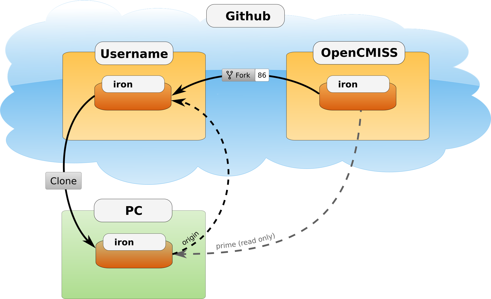
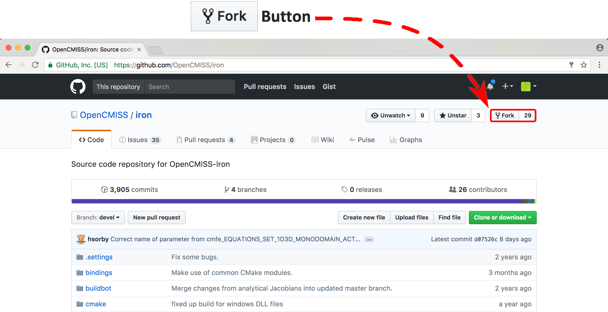

=================
Development Setup
=================

This section describes how someone wanting to contribute to the OpenCMISS project should set up their *working copy* for developing OpenCMISS.

.. contents::

Overview
========

The OpenCMISS codebase is hosted on GitHub and therefore Git is used to track changes in the codebase.  Before you begin you will need to have a few prerequisites satisfied:

#. GitHub user account
#. Git installed

This document doesn't cover the process of satisfying these prerequisites, it is left as an exercise for you (Google is your friend).  The remainder of this document assumes that these prerequisites have been met.  This document covers setup from the command line if you are using a GUI like 'GitHub for Windows' or 'Pycharm' then you will need to adjust the commands for the GUI you are using.

The goal here is to get a working copy of source code, tests, and documentation onto your PC so that you can begin development.  To make this happen you will need to fork a :term:`prime OpenCMISS repository`, make a clone onto your PC, and set up the Git remotes.  In :numref:`fig_devSetup_githubRepos` you can see a pictorial representation of what we are aiming to achieve.

.. _fig_devSetup_githubRepos:

   Setup of repositories for development

The four steps to getting set up are detailed below.

Forking your own copy
=====================

Login to GitHub using your credentials and go to the OpenCMISS GitHub organisation page::

   https://github.com/OpenCMISS

The OpenCMISS organisation contains the git repositories for each of
its components, documentation and tools:

   - https://github.com/OpenCMISS/iron
   - https://github.com/OpenCMISS/zinc
   - https://github.com/OpenCMISS/examples
   - https://github.com/OpenCMISS/documentation
   - https://github.com/OpenCMISS/website
   - https://github.com/OpenCMISS/manage

Select the repository that you wish to develop and use the fork button to create a fork of the repository under your own account, see :numref:`fig_devSetup_githubFork` for locating this button. The remainder of this documentation will assume you have selected the iron repository, however, the steps outlined below can be applied to any of the repositories in the OpenCMISS organisation.

.. _fig_devSetup_githubFork:

   Fork button for the OpenCMISS iron repository

Clone
=====

You now need to clone the selected repository to your PC. Do this by going to your fork at::

   https://github.com/username/iron

where *username* is your GitHub user account.

On the right hand side of the webpage on your fork of the repository you can get the link for cloning the repository to your PC, in our example::

        git@github.com:username/iron.git

Now clone the repository::

        cd <somewhere/you/keep/development/code>
        git clone git@github.com:username/iron.git

Set Git remotes
===============

You now need to setup a read-only remote connection to the prime repository.  Given that you are still in the directory where you cloned the iron repository from do the following::

   cd iron
   git remote add prime git@github.com:OpenCMISS/iron.git
   git config remote.prime.pushurl "you really didn't want to do that"

You have now added a new remote named **prime** and set origin as the default fetch and push location to point at repositories under your control on GitHub.  Here **prime** is a reference to the main definitive repository where releases are made from for the OpenCMISS project.  You have also set the **prime** repository as read-only by setting an invalid push url.

Finally
=======

You are all done and ready to start development, read the documentation on how to build OpenCMISS then read :doc:`Contribution <dev_contribution>` to get your changes into OpenCMISS's prime repository.

.. toctree::
   :maxdepth: 1

.. Pages that don't need to be shown can be included under this toctree.
.. toctree::
   :hidden:
