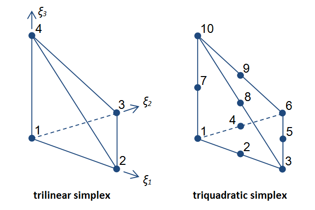

The EX File Format
==================

A description of the EX file format used across OpenCMISS and legacy CMISS software to exchange interpolated finite element fields defined on meshes and sets of nodes, including support for defining sub-groups.

Overview
--------

Spatially-varying finite element field definitions are frequently interchanged in EX format in two parts:

1. ``.exnode`` files containing definitions of nodes which are points identified by a unique integer identifier, and for which field parameters are listed.

2. ``.exelem`` files containing definitions of elements which are n-dimensional coordinate spaces, and the functions giving field values over them, usually by interpolating node field parameters.

This division is arbitrary since the EX format is able to describe both together, however for time-varying problems it is often convenient to write the element file once and have one node file per time step. The extensions ``.exnode`` and ``.exelem`` are conventions for use in this manner. While no particular filename extension is mandated, it is recommended that extensions be of the form ``.ex~`` since the OpenCMISS-Zinc Library (at least) can automatically recognise the format from this. The extention ``.exfile`` is recommended for EX files defining both nodes and elements.

Nodes with literal field values stored for them do not just support element interpolation, but are widely used to represent any point data, and there need not be any associated elements. Occasionally, one sees files with the ``.exdata`` extension, which are identical in format to ``.exnode`` files, however the content is typically read into different data structures, for example dedicated data points.

General Syntax
--------------

EX files are mostly human-readable text files. Ideally they are created by a tool such as OpenCMISS-Zinc, Iron or legacy CMISS, but script or hand generation is feasible with care. One of the strengths of this format is that headers are used to describe nodes or elements that follow, and it is simple to add new nodes or elements consistent with the header below it.

The EX format has been around for many years and has several exacting rules which can catch the unwary:

#. Main blocks of the file begin with keywords such as ``Region``, ``Group name``, ``Shape``, ``#Fields``, ``Node``, ``Element`` which must be written in full with exact capitalization. Within these blocks are further keywords indicating sub-blocks of data to be read, each with their own rigid rules.

#. Comments and directives start are lines starting with an exclamation mark ``!`` and may only be used where a main block keyword would otherwise be expected.

#. The characters used to separate keywords, identifiers, parameters and other data are quite inconsistent and could be white space, commas, colons, full stops (periods), equal signs and so on. In each case the precise character must be used. Whitespace separators generally include any number of spaces, tabs, end of line and line feed characters. Non-whitespace separator characters can generally be surrounded by whitespace.

#. All array indices start at 1, but scale factor index 0 has the special meaning of using unit scale factor value, 1.0.

#. Node and element identifiers must be non-negative integers.

Tools such as OpenCMISS-Zinc and Cmgui will in most cases report the line number in the file at which the first errant text is located; this should not be confused with line element numbers. Unfortunately the actual problem may be earlier: if the previous block was incomplete then the first text of the next block, however correct, will be complained about as not matching the keywords and data expected for the previous block.

Region
------

The EX format defines fields, nodes, elements and groups (sets of nodes and elements) within *Regions*. These objects belong to their respective Region and are independent of same-labelled objects in other regions.

Since Cmgui version 2.6 (May 2009), the EX format has a ``Region`` keyword which specifies the path to the region which any following fields and objects are defined within until the next ``Region`` keyword or end of file. Prior to the first ``Region`` keyword, data is read into the root region ``/``. 

The format is as follows::

 Region: /PATH_TO_REGION

Examples::

 ! The root region for this file:
 Region: /

 ! Region "joe" within region "bob":
 Region: /bob/joe

The region path must always be written as an absolute path from the root region of the file, i.e. as a series of zero or more region names starting with and separated by forward slash ``/`` characters. Region names may contain any characters except the forward slash separator. The path consists of all characters following the colon ``:`` to the end of the line but with leading and trailing whitespace characters removed. All other whitespace within the path becomes part of region names.

The first non-comment keyword in and EX file should be a Region or Group (see below).

An EX file may contain any number of regions and groups.

Groups
------

The Group keyword indicates that all following nodes and elements until the next Group or Region keyword are made part of the group (set) of the specified name::

 Group name: GROUP_NAME

There can be any number of groups in a single region, each potentially sharing some or all of the same nodes and elements from the region they belong to. Groups are entirely contained within their particular region; groups with the same name in different regions are independent.

The group name consists of all characters following the colon ``:`` to the end of the line but with leading and trailing whitespace characters removed. Whitespace characters are valid within the name.

In older EX files it was common to have fields defined after/within a group declaration. However the grouping only ever applies to nodes and element: fields always belong to the region. It is more common to define the fields with nodes and elements under the region with no group, and list only node and element identifiers with no fields under the groups.

Field declaration headers
-------------------------

Whether the EX file is listing nodes or elements, there is broad similarity in the way in which they and their field data is listed. It consists of a header declaring the number and details of fields being defined for the respective object type, followed by the definitions of the objects themselves. An example header::

 #Fields=1
 1) coordinates, coordinate, rectangular cartesian, real, #Components=3
 ... field data specific to nodes or elements ...

The above header declares a field with the name ``coordinates`` The field is tagged as type ``coordinate``, a hint for software that this field is appropriate for use as a coordinate field. Other field type hints are ``anatomical`` for special fibre fields, and ``field`` for all other fields.

The coordinates declared in this header are embedded in a ``rectangular cartesian`` coordinate system with 3 ``real`` valued components. Other coordinates systems may have additional data such as focus for prolate spheroidal and oblate spheroidal, as in the example later. Following the coordinate systems is the value type of the field, most commonly ``real``; other types such as ``integer``, ``string`` and ``element_xi`` (embedded locations in elements) are only usable in node fields and ``integer`` for grid-based element fields. Either the coordinate system or the value type may be omitted (but not both) in which case ``rectangular cartesian`` or ``real`` is assumed.

More complex declarations are given throughout this document. Note that if there is no header or the header has "#Fields=0", then nodes and elements can be defined or listed for adding to a group without defining fields.

Following each line declaring the main details of a field are the details of each field component including the name and the parameter values to be supplied with each node, or the basis functions and parameter mappings to be used with each element. These are described later.

There can be only one field of a given name in a region, but it can be defined on nodes, elements and data in that region provided the field is consistently declared in the header, including same value type, numbers of components and component names.

Note that the #Fields keyword in element field headers are additionally preceded by the following keywords and sub-blocks which are described in later examples::

 #Scale factor sets=~
 ...
 #Nodes=~

Comments
--------

Since Cmgui version 2.6 (May 2009), EX files may contain comments.

Comment lines begin with the exclamation mark character ``!`` and may only be placed in parts of the file where a ``Region``, ``Group name``, ``Shape``, ``Node``, ``Element``, ``Values`` or ``#Fields`` header keyword is permitted. Putting comments anywhere else will result in obscure errors or undefined behaviour!

Comments are useful for adding source details or copyright/license information to your files, or to document parts of the file. Software tools typically ignore comment lines on reading, but are free to put any useful information out in comments when exporting an EX file.

Some example comments preceding other keywords::

 ! Copyright (C) 2015 The Author
 Region: /heart

 ! Exported by OpenCMISS-Zinc v3.0.1
 Region: /heart

 ! The following node is the apex of the heart:
 ! It has 10 versions of all nodal parameters
 Node: 13

Defining nodes and node fields
------------------------------

Specifying 3-D coordinates of nodes
^^^^^^^^^^^^^^^^^^^^^^^^^^^^^^^^^^^

Following is an example reading 8 nodes numbered from 1 to 8, with a field named ``coordinates`` giving positions at the corners of a unit cube::

  Region: /cube
  Shape. Dimension=0
  #Fields=1
  1) coordinates, coordinate, rectangular cartesian, #Components=3
   x. Value index=1, #Derivatives=0
   y. Value index=2, #Derivatives=0
   z. Value index=3, #Derivatives=0
  Node: 1
   0.0 0.0 0.0
  Node: 2
   1.0 0.0 0.0
  Node: 3
   0.0 1.0 0.0
  Node: 4
   1.0 1.0 0.0
  Node: 5
   0.0 0.0 1.0
  Node: 6
   1.0 0.0 1.0
  Node: 7
   0.0 1.0 1.0
  Node: 8
   1.0 1.0 1.0

Notes:

* The first line indicates that the following objects will be put into region ``cube``. EX files must begin with a ``Region`` or ``Group`` declaration.

* The second line says that zero dimensional nodes are to be read until a different shape is specified. This is seldom seen in older ``.exnode`` files since 0-D nodes are the default shape at the start of file read and when any new region or group is started.

* The next five lines up to the first Node is a node field header which declares finite element fields and indicates what field parameters will be read in with any nodes defined after the header. The first line of the header indicates only one field follows.

* The first line following the #Fields declares a 3-component coordinate-type field called ``coordinates`` whose values are to be interpreted in a ``rectangular cartesian`` coordinate system. This field defaults to having real values.

* Following the declaration of the field are the details of the components including their names and the parameter values held for each. The EX format requires at a minimum one value of each field component at each node -- a limitation that will be removed in future. The above node field component definitions indicate that there are no derivative parameters. The ``Value index`` is redundant since the index of where values for components ``x``, ``y`` and ``z`` of the ``coordinates`` field are held in each node's parameter list is calculated assuming they are in order; the correct index is written for interest only.

* Finally each of the nodes are listed followed by the number of parameters specified in the node field header.

Example: multiple node fields and derivative parameters
^^^^^^^^^^^^^^^^^^^^^^^^^^^^^^^^^^^^^^^^^^^^^^^^^^^^^^^

A slightly more complex example adds a second field ``temperature``::

  Region: /heated_bar
  #Fields=2
  1) coordinates, coordinate, rectangular cartesian, #Components=2
   x. Value index=1, #Derivatives=0
   y. Value index=2, #Derivatives=0
  2) temperature, field, real, #Components=1
   1. Value index=3, #Derivatives=1 (d/ds1)
  Node: 1
   0.0 0.0
   37.0 0.0
  Node: 2
   1.0 0.0
   55.0 0.0
  Node: 3
   2.0 0.0
   80.2 0.0

Notes:

* The ``coordinates`` field is now 2-dimensional. Beware it isn't possible to have a 2-component and 3-component field of the same name in the same region.

* The temperature field is of ``field`` type since it has no special meaning.

* The scalar (single component) temperature field has two parameters for each node, the first being the temperature at the node, the second being a nodal derivative. The text ``(d/ds1)`` labels the derivative parameter as the derivative of the temperature with respect to a spatial direction ``s1``. It isn't until the definition of element interpolation that its contribution to the element field is known.

Node derivatives and versions in the prolate heart
^^^^^^^^^^^^^^^^^^^^^^^^^^^^^^^^^^^^^^^^^^^^^^^^^^

The following part example shows the nodal parameters held at the apex of a prolate heart model::

  #Fields=2
   1) coordinates, coordinate, prolate spheroidal, focus=0.3525E+02, #Components=3
    lambda. Value index=1,#Derivatives=3 (d/ds1,d/ds2,d2/ds1ds2)
    mu. Value index=5, #Derivatives=0
    theta. Value index=6,#Derivatives=0, #Versions=10
   2) fibres, anatomical, fibre, #Components=3
    fibre angle. Value index=16, #Derivatives=1 (d/ds1)
    imbrication angle. Value index=18, #Derivatives= 0
    sheet angle. Value index=19, #Derivatives=3 (d/ds1,d/ds2,d2/ds1ds2)
  Node: 13
    0.984480E+00   0.000000E+00   0.000000E+00   0.000000E+00
    0.000000E+00
    0.253073E+00   0.593412E+00   0.933751E+00   0.127409E+01   0.188932E+01   0.250455E+01   0.373500E+01   0.496546E+01   0.558069E+01   0.619592E+01
   -0.138131E+01  -0.117909E+01
    0.000000E+00
   -0.827443E+00  -0.108884E+00  -0.245620E+00  -0.153172E-01

Notes:

* This example uses a prolate spheroidal coordinate system for the coordinate field. This is inherently heart-like in shape allowing fewer parameters to describe the heart, provided it is positioned near the origin. The ``focus`` parameter sets the size of the model, giving linear scaling when converting to rectangular Cartesian coordinates.

* The ``theta`` component of the prolate coordinates has 10 versions meaning there are 10 versions of each value and derivative specified. In this case there are no derivatives so only 10 values are read in. 10 versions are used to supply the angles at which each line element heads away from the apex of the heart which is on the axis of the prolate spheroidal coordinate system.

* Node field parameters are always listed in component order, and for each component in the order:

  |  value then derivatives for version 1
  |  value then derivatives for version 2
  |  etc.

* The second field ``fibres`` is an ``anatomical`` type field with a ``fibre`` coordinate system. In elements these fields are interpreted as Euler angles for rotating an ortho-normal coordinate frame initially oriented with element's *xi* axes and used to define axes of material anisotropy, such as muscle fibres in tissue.

Points embedded in a mesh
^^^^^^^^^^^^^^^^^^^^^^^^^

The following EX file defines a node field containing embedded locations within elements::

  Group name: xi_points
  #Fields=1
  1) embedded_location, field, element_xi, #Components=1
   1. Value index=1, #Derivatives=0
  Node: 1
   E 1 3 0.25 0.25 0.75
  Node: 2
   E 1 3 0.25 0.5 0.75
  Node: 3
   E 1 3 1 0.25 0.75
  Node: 4
   E 1 3 1 1 1
  Node: 5
   E 1 3 0 0 0

Notes:

* The field named ``embedded_location`` uses the special value type ``element_xi`` indicating it returns a reference to an element and a location within its *xi* coordinate space. Only 1 component and no derivatives or versions are permitted with this value type.

* The embedded locations themselves are written as:

 {``Element|Face|Line``} *number* *dimension* *xi-coordinates*

 where ``Element``, ``Face`` (2-D) and ``Line`` (1-D) can be upper or lower case, and shortened to as little as one letter. This is followed by the element number, the element dimension and as many coordinates in the element's *xi* chart as its dimension. Hence node 1 has a location in 3-dimensional element number 1 where *xi* = (0.25,0.25,0.75).

Software tools may insist that the host elements are read simultaneously or prior to reading the embedded locations. This is an issue because the embedded locations do not specify the shape of the element. One approach is to define the host elements in the same file with a shape only.

**Note:** The embedded location format has historically permitted embedded locations in elements of different dimensions. This is deprecated; in future embedded locations for such a field must be in a single mesh of fixed dimension.

Special field types
^^^^^^^^^^^^^^^^^^^

Legacy Cmgui examples a/exnode_formats and a/exelem_formats list several other special field types including constant (one value for all the nodes it is defined on) and indexed (value indexed by the value of a second integer *index field*), but their use is discouraged and they should be considered deprecated.

Defining elements and element fields
------------------------------------

Cmgui elements, shapes, faces and identifiers
^^^^^^^^^^^^^^^^^^^^^^^^^^^^^^^^^^^^^^^^^^^^^

Elements are objects comprising an n-dimensional (with n>0) coordinate space serving as a material coordinate system charting part or all of a body of interest. The set of elements covering the whole model is referred to as a mesh. We often use the Greek letter *xi* to denote the local material coordinates within each element.

Each element has a shape which describes the bounds of its coordinate space. Shapes are declared in the EX format are follows:

 ``Shape. Dimension=#`` [*shape-description*]

Up to three dimensions are supported. The most important shape descriptions are in the following table.

=================================================== ==================================================
Shape Declaration                                   Shape, coordinate bounds
=================================================== ==================================================
``Shape. Dimension=0``                              point shape i.e. node
``Shape. Dimension=1 line``                         line shape, *xi* covering [0,1]
``Shape. Dimension=2 line*line``                    square on [0,1]
``Shape. Dimension=2 simplex(2)*simplex``           triangle on [0,1]; xi1+xi2<1
``Shape. Dimension=3 line*line*line``               cube on [0,1]
``Shape. Dimension=3 simplex(2;3)*simplex*simplex`` tetrahedron on [0,1]; xi1+xi2+xi3<1
``Shape. Dimension=3 simplex(2)*simplex*line``      triangle wedge, line on xi3 (+ other permutations)
=================================================== ==================================================

[Special polygon element shapes may also be seen in older EX files, but these should be considered deprecated.]

The shape description works by describing the span of the space along each xi direction for its dimension. The simplest cases are the line shapes: "line*line*line" indicates the tensor product of three line shapes, thus describing a cube.
If the shape description is omitted then line shape is assumed for all dimensions. Simplex shapes, used for triangles and tetrahedra, cannot be simply described by an outer product and must be tied to another dimension; in the EX format the tied dimension is written in brackets after the first simplex coordinate, and for 3 or higher dimensional simplices all linked dimensions must be listed as shown for the tetrahedron shape.

Elements of a given shape have a set number of faces of dimension one less than their own. A cube element has 6 square faces at xi1=0, xi1=1, xi2=0, xi2=1, xi3=0, xi3=1. Each square element itself has 4 faces, each of line shape. The faces of elements are themselves elements, but they exist in separate meshes from their parents.

The cmgui EX format uses a peculiar naming scheme for elements, consisting of 3 integers: the element number, the face number and the line number, only one of which should ever be non-zero. All elements over which fields are defined or which are not themselves the faces of a higher dimensional element use the first identifier, the element number. All 2-D faces of 3-D elements use the face number and all 1-D faces of 2-D elements (including faces of faces of 3-D elements) use the line number. The element identifier "0 0 0" may be used to indicate a NULL face.

Element nodes, scale factors and parameter mappings
^^^^^^^^^^^^^^^^^^^^^^^^^^^^^^^^^^^^^^^^^^^^^^^^^^^

In the EX file format, elements have an array of local nodes which map to global nodes from which field parameters are extracted for interpolation by basis functions. This local node array can be as long as needed. It may contain repeated references to the same nodes, however it is usually preferable not to do this.

Elements can also have an array of real-valued scale factors for each basis function (see below).

These two arrays are combined in mapping global node parameters to an array of element field parameters ready to be multiplied by the basis function values to give the value of a field at any *xi* location in the element.

Mappings generally work by taking the field component parameter at index i from the node at local index j and multiplying it by the scale factor at index k for the basis function in-use for that field component. It is also possible to use a unit scale factor by referring to the scale factor at index 0, and to not supply a scale factor set if only unit scale factors are in use.

Later examples describe several complex global-to-local parameter mappings.

Element basis functions
^^^^^^^^^^^^^^^^^^^^^^^

Basis functions are defined in the EX format in a very similar manner to element shapes, by tensor product of 1-D basis functions as described in the following table.

=================== =================================
Basis function name Meaning
=================== =================================
``constant``        constant
``l.Lagrange``      linear Lagrange
``q.Lagrange``      quadratic Lagrange
``c.Lagrange``      cubic Lagrange
``c.Hermite``       cubic Hermite
``LagrangeHermite`` Lagrange at xi=0, Hermite at xi=1
``HermiteLagrange`` Hermite at xi=0, Lagrange at xi=1
``l.simplex``       linear simplex (see below)
``q.simplex``       quadratic simplex (see below)
=================== =================================

[Special polygon basis functions for polygon-shaped elements may be seen in older EX files, but these should be considered deprecated.]

**Note:** The OpenCMISS software development team is open to adding support for other basis types such as cubic simplex, serendipity, Bezier, Fourier etc.

Lagrange, Hermite and many other 1-D basis functions are able to be combined in multiple dimensions by tensort product. This is not the case for simplex (and serendipity) families of basis functions which, like element shapes, require linked xi dimensions to be specified.

Some examples of multi-dimensional element bases are given in the following table.

====================================== ==========================================================
Basis description                      Meaning
====================================== ==========================================================
``l.Lagrange*l.Lagrange*l.Lagrange``   trilinear interpolation (8 nodes)
``c.Hermite*c.Hermite``                bicubic Hermite (4 nodes x 4 params)
``l.simplex(2)*l.simplex``             linear triangle (3 nodes)
``q.simplex(2;3)*q.simplex*q.simplex`` quadratic tetrahedron (10 nodes)
``l.simplex(3)*l.simplex*c.Hermite``   linear triangle*cubic Hermite (6 nodes, 2 parameters/node)
``constant*constant*l.Lagrange``       constant in xi1 and xi2, linearly varying in xi3
====================================== ==========================================================

Most element bases have one basis functions per node which multiplies a single parameter obtained from that node. For instance, a linear Lagrange basis expects 2 nodes each with 1 parameter per field component. A bilinear Lagrange basis interpolates a single parameter from 4 nodes at the corners of a unit square. A 3-D linear-quadratic-cubic Lagrange element basis expects 2*3*4 nodes along the respective *xi* directions, with 1 basis function and one parameter for each node. A linear triangle has 3 nodes with 1 parameter each; a quadratic triangle has 6 nodes with 1 parameter.

1-D Hermite bases provide 2 basis functions per node, expected to multiple two parameters:

1. the value of the field at the node;
2. the derivative of that field value with respect to the *xi* coordinate.
 
If this derivative is common across an element boundary then the field is C\ :sub:`1`-continuous there. Tensor products of 1-D Hermite basis functions double the number of parameters per node for each Hermite term. A bicubic Hermite basis expect 4 nodes with 4 basis functions per node, multiplying 4 nodal parameters which are:

1. the value of the field;
2. the derivative of the field with respect to the first *xi* coordinate;
3. the derivative of the field with respect to the second *xi* coordinate;
4. the double derivative of the field with respect to both *xi* coordinates, called the *cross derivative*.

Tri-cubic Hermite bases have 8 basis functions per node, one multiplying the value, 3 for first derivatives, 3 for second (cross) derivatives and a final function multiplying a triple cross derivative parameter.

The EX format requires nodes contributing parameters for multiplication by a basis to be in a very particular order: changing fastest in xi1, then xi2, then xi3, and so on. Note this is not necessarily the order nodes are stored in the element node array, just the order in which those nodes are referenced in the parameter map. In most example files the order of the nodes in the element node list will also follow this pattern.

Legacy Cmgui example a/element_types provides a large number of sample elements using complex combinations of basis functions on supported 3-D element shapes.

Tri-linear interpolation over a cube
^^^^^^^^^^^^^^^^^^^^^^^^^^^^^^^^^^^^

Following is an example of a coordinate field defined over a unit cube, with faces and scale factors removed to cut the example down to minimum size, and assuming the cube node file from earlier has already been loaded::

  Region: /cube
  Shape.  Dimension=3  line*line*line
  #Scale factor sets=0
  #Nodes=8
  #Fields=1
   1) coordinates, coordinate, rectangular cartesian, #Components=3
     x.  l.Lagrange*l.Lagrange*l.Lagrange, no modify, standard node based.
     #Nodes= 8
      1.  #Values=1
       Value indices:     1
       Scale factor indices:   0
      2.  #Values=1
       Value indices:     1
       Scale factor indices:   0
      3.  #Values=1
       Value indices:     1
       Scale factor indices:   0
      4.  #Values=1
       Value indices:     1
       Scale factor indices:   0
      5.  #Values=1
       Value indices:     1
       Scale factor indices:   0
      6.  #Values=1
       Value indices:     1
       Scale factor indices:   0
      7.  #Values=1
       Value indices:     1
       Scale factor indices:   0
      8.  #Values=1
       Value indices:     1
       Scale factor indices:   0
     y.  l.Lagrange*l.Lagrange*l.Lagrange, no modify, standard node based.
     #Nodes= 8
      1.  #Values=1
       Value indices:     1
       Scale factor indices:   0
      2.  #Values=1
       Value indices:     1
       Scale factor indices:   0
      3.  #Values=1
       Value indices:     1
       Scale factor indices:   0
      4.  #Values=1
       Value indices:     1
       Scale factor indices:   0
      5.  #Values=1
       Value indices:     1
       Scale factor indices:   0
      6.  #Values=1
       Value indices:     1
       Scale factor indices:   0
      7.  #Values=1
       Value indices:     1
       Scale factor indices:   0
      8.  #Values=1
       Value indices:     1
       Scale factor indices:   0
     z.  l.Lagrange*l.Lagrange*l.Lagrange, no modify, standard node based.
     #Nodes= 8
      1.  #Values=1
       Value indices:     1
       Scale factor indices:   0
      2.  #Values=1
       Value indices:     1
       Scale factor indices:   0
      3.  #Values=1
       Value indices:     1
       Scale factor indices:   0
      4.  #Values=1
       Value indices:     1
       Scale factor indices:   0
      5.  #Values=1
       Value indices:     1
       Scale factor indices:   0
      6.  #Values=1
       Value indices:     1
       Scale factor indices:   0
      7.  #Values=1
       Value indices:     1
       Scale factor indices:   0
      8.  #Values=1
       Value indices:     1
       Scale factor indices:   0
   Element:     1 0 0
     Nodes:
       1     2     3     4     5     6     7     8

Notes:

* ``Shape. Dimension=3 line*line*line`` declares that elements defined after this header are cube-shaped.

* ``#Scale factor sets=0`` indicates no scale factors are to be read in with the elements that follow. Scale factors are usually only needed for Hermite basis functions when nodal derivative parameters are maintained with respect to a physical distance and the scale factors convert the derivative to be with respect to the element xi coordinate. It's best to avoid scale factors when not needed.

* The 4th line ``#Nodes=8`` says that 8 nodes will be listed with all elements defined under this header.

* Under the declaration of the ``coordinates`` field (which is identical to its declaration for the nodes) are the details on how the field is evaluated for each field component in the elements. Each field component is always described separately: each may use different basis functions and parameter mappings. In this example the components ``x``, ``y`` and ``z`` all use the same tri-linear basis functions and use an identical parameter mapping except that parameters are automatically mapped for the corresponding component at the node.

* ``no modify`` in the element field component definition is an instruction to do no extra value manipulations as part of the interpolation. Other modify instructions resolve the ambiguity about which direction one interpolates angles in polar coordinates. The possible options are ``increasing in xi1``, ``decreasing in xi1``, ``non-increasing in xi1``, ``non-decreasing in xi1`` or ``closest in xi1``. For use, see the prolate heart example later.

* ``standard node based`` indicates that each element field parameter is obtained by taking one parameter from a node and optionally multiplying it by one scale factor. [An alternative *general node based* mapping is under development and allows element field parameters to be weighted sums of multiple node field parameters, which is a preferable way to handle mapping derivatives for Hermite basis functions at complex joints in the mesh, such as the apex of the heart.] A further option ``grid based`` is described in a later example.

* Following the above text are several lines describing in detail how all the element field parameters are evaluated prior to multiplication by the basis functions. Being a tri-linear Lagrange basis, 8 parameters must be mapped, each expected to be from a separate node, hence the text ``#Nodes=8``.

  Following are 8 sets of three lines each indicating the index of the node in the element's local node array from which parameters are extracted (in this case the uncomplicated sequence 1,2,3,4,5,6,7,8), the number of values to be extracted (1), the index of the each parameter value in the list of parameters for that field component at that node and the index of the scale factor multiplying it from the scale factor array for that basis, or zero to indicate a unit scale factor::

    1.  #Values=1
     Value indices:     1
     Scale factor indices:   0

  As mentioned earlier, the nodes listed in the mapping section must always follow a set order, increasing in xi1 fastest, then xi2, then xi3, etc. to match the order of the basis functions systematically generated from the basis description.

* At the end of the example is the definition of element 1 (identifier ``1 0 1``) which lists the global nodes corresponding to its 8 local nodes, in this case 1 to 8. The next element will have a different set of nodes (some shared if neighbouring), which allows its fields to be uniquely defined from the same element field header.

Defining faces and lines
^^^^^^^^^^^^^^^^^^^^^^^^

The above example does not define any 2-D faces of the 3-D element, and 1-D lines on the faces of the 2-D face elements. Often this is sufficient since tools such as OpenCMISS-Zinc/Iron and Cmgui can define shared faces from shared nodes used by neighbouring elements. However, this can be expensive. The EX format allows the faces and lines and the mappings from their parents to be exchanged too, as in the following example::

  Region: /cube
  Shape.  Dimension=1 line
   Element: 0 0 1
   Element: 0 0 2
   Element: 0 0 3
   Element: 0 0 4
   Element: 0 0 5
   Element: 0 0 6
   Element: 0 0 7
   Element: 0 0 8
   Element: 0 0 9
   Element: 0 0 10
   Element: 0 0 11
   Element: 0 0 12
  Shape.  Dimension=2 line*line
   Element: 0 1 0
     Faces:
     0 0 3
     0 0 7
     0 0 2
     0 0 10
   Element: 0 2 0
     Faces:
     0 0 5
     0 0 8
     0 0 4
     0 0 11
   Element: 0 3 0
     Faces:
     0 0 1
     0 0 9
     0 0 3
     0 0 5
   Element: 0 4 0
     Faces:
     0 0 6
     0 0 12
     0 0 7
     0 0 8
   Element: 0 5 0
     Faces:
     0 0 2
     0 0 4
     0 0 1
     0 0 6
   Element: 0 6 0
     Faces:
     0 0 10
     0 0 11
     0 0 9
     0 0 12
  Shape.  Dimension=3 line*line*line
   Element: 1 0 0
     Faces:
     0 1 0
     0 2 0
     0 3 0
     0 4 0
     0 5 0
     0 6 0
     Nodes:
      1 2 3 4 5 6 7 8

When scale factors are in use these are also listed per-element. Grid-based fields and per-element constants additionally supply field parameters at elements which once again need to be listed. Examples of these cases are listed later.

Collapsed square element
^^^^^^^^^^^^^^^^^^^^^^^^

The following tricky example collapses a square element to a triangle by using the third local node twice::

  Region: /collapse
  Shape. Dimension=0
  #Fields=1
  1) coordinates, coordinate, rectangular cartesian, #Components=2
   x. Value index=1, #Derivatives=0
   y. Value index=2, #Derivatives=0
  Node: 1
   0.0 0.0
  Node: 2
   1.0 0.0
  Node: 3
   0.5 1.0
  Shape.  Dimension=1  line
   Element: 0 0 1
   Element: 0 0 2
   Element: 0 0 3
  Shape.  Dimension=2  line*line
  #Scale factor sets=0
  #Nodes=3
  #Fields=1
   1) coordinates, coordinate, rectangular cartesian, #Components=2
     x.  l.Lagrange*l.Lagrange, no modify, standard node based.
     #Nodes= 4
      1.  #Values=1
       Value indices:     1
       Scale factor indices:   0
      2.  #Values=1
       Value indices:     1
       Scale factor indices:   0
      3.  #Values=1
       Value indices:     1
       Scale factor indices:   0
      3.  #Values=1
       Value indices:     1
       Scale factor indices:   0
     y.  l.Lagrange*l.Lagrange, no modify, standard node based.
     #Nodes= 4
      1.  #Values=1
       Value indices:     1
       Scale factor indices:   0
      2.  #Values=1
       Value indices:     1
       Scale factor indices:   0
      3.  #Values=1
       Value indices:     1
       Scale factor indices:   0
      3.  #Values=1
       Value indices:     1
       Scale factor indices:   0
  Element: 1 0 0
     Faces:
     0 0 1
     0 0 2
     0 0 3
     0 0 0
     Nodes:
      1 2 3

Notes:

* Element ``1 0 0`` has a node array with only 3 nodes in it, but the third and fourth parameter mappings both refer to the node at index 3 in the element node list.

* Note that the face on the collapsed side of the element is undefined, as indicated by special face identifier ``0 0 0``.

* It is also possible to obtain an equivalent result by physically storing 4 nodes in the element but repeating node 3 in that array.

Simplex elements: triangle with mixed bases
^^^^^^^^^^^^^^^^^^^^^^^^^^^^^^^^^^^^^^^^^^^

The following example defines a single triangle element with 3 fields on it, a 2-D coordinate field and pressure field using bilinear simplex interpolation, and a velocity field using biquadratic simplex interpolation. It shows that not all field parameters need to be defined at all nodes::

  Region: /
   !#nodeset nodes
   #Fields=3
   1) coordinates, coordinate, rectangular cartesian, #Components=2
    x.  Value index=1, #Derivatives=0, #Versions=1
    y.  Value index=2, #Derivatives=0, #Versions=1
   2) pressure, field, rectangular cartesian, #Components=1
    p.  Value index=3, #Derivatives=0, #Versions=1
   3) velocity, field, rectangular cartesian, #Components=2
    u.  Value index=4, #Derivatives=0, #Versions=1
    v.  Value index=5, #Derivatives=0, #Versions=1
   Node: 1
   0.000000000000000e+000
   0.000000000000000e+000
   6.415429760000000e+000
   2.000000000000000e-002
   0.000000000000000e+000
   Node: 2
   1.000000000000000e+000
   0.000000000000000e+000
   2.015246850000000e-001
   6.000000000000000e-001
   1.000000000000000e+000
   Node: 3
   0.000000000000000e+000
   1.000000000000000e+000
   -1.342914410000000e-005
   -1.000000000000000e+000
   -5.000000000000000e-001
   #Fields=1
   1) velocity, field, rectangular cartesian, #Components=2
    u.  Value index=1, #Derivatives=0, #Versions=1
    v.  Value index=2, #Derivatives=0, #Versions=1
   Node: 4
   8.000000000000000e-001
   2.500000000000000e-001
   Node: 5
   3.000000000000000e-001
   5.000000000000000e-001
   Node: 6
   -1.000000000000000e+000
   1.000000000000000e+000
   Shape. Dimension=1, line
   #Scale factor sets=0
   #Nodes=0
   #Fields=0
   Element: 0 0 1
   Element: 0 0 2
   Element: 0 0 3
   Shape. Dimension=2, simplex(2)*simplex
   #Scale factor sets=0
   #Nodes=6
   #Fields=3
   1) coordinates, coordinate, rectangular cartesian, #Components=2
   x. l.simplex(2)*l.simplex, no modify, standard node based.
     #Nodes=3
     1. #Values=1
       Value labels: value
       Scale factor indices: 0
     2. #Values=1
       Value labels: value
       Scale factor indices: 0
     3. #Values=1
       Value labels: value
       Scale factor indices: 0
   y. l.simplex(2)*l.simplex, no modify, standard node based.
     #Nodes=3
     1. #Values=1
       Value labels: value
       Scale factor indices: 0
     2. #Values=1
       Value labels: value
       Scale factor indices: 0
     3. #Values=1
       Value labels: value
       Scale factor indices: 0
   2) pressure, field, rectangular cartesian, #Components=1
   p. l.simplex(2)*l.simplex, no modify, standard node based.
     #Nodes=3
     1. #Values=1
       Value labels: value
       Scale factor indices: 0
     2. #Values=1
       Value labels: value
       Scale factor indices: 0
     3. #Values=1
       Value labels: value
       Scale factor indices: 0
   3) velocity, field, rectangular cartesian, #Components=2
   u. q.simplex(2)*q.simplex, no modify, standard node based.
     #Nodes=6
     1. #Values=1
       Value labels: value
       Scale factor indices: 0
     4. #Values=1
       Value labels: value
       Scale factor indices: 0
     2. #Values=1
       Value labels: value
       Scale factor indices: 0
     5. #Values=1
       Value labels: value
       Scale factor indices: 0
     6. #Values=1
       Value labels: value
       Scale factor indices: 0
     3. #Values=1
       Value labels: value
       Scale factor indices: 0
   v. q.simplex(2)*q.simplex, no modify, standard node based.
     #Nodes=6
     1. #Values=1
       Value labels: value
       Scale factor indices: 0
     4. #Values=1
       Value labels: value
       Scale factor indices: 0
     2. #Values=1
       Value labels: value
       Scale factor indices: 0
     5. #Values=1
       Value labels: value
       Scale factor indices: 0
     6. #Values=1
       Value labels: value
       Scale factor indices: 0
     3. #Values=1
       Value labels: value
       Scale factor indices: 0
   Element: 1 0 0
   Faces:
   0 0 1
   0 0 2
   0 0 3
   Nodes:
   1 2 3 4 5 6

The local node and basis function ordering for linear and quadratic triangles is the order shown on the base of tetrahedra in :ref:`fig_ex_tetrahedra_bases`.

Simplex elements: tetrahedra
^^^^^^^^^^^^^^^^^^^^^^^^^^^^

Linear and quadratic tetrahedra follow a similar pattern to triangles with the appropriate shape and basis functions linked on all three element coordinates, as described earlier. The local node and basis function ordering is given in the following figure.

.. _fig_ex_tetrahedra_bases:

   Simplex basis function ordering for tetrahedra in the EX format.

Multiple fields, bases and scale factor sets in the prolate heart
^^^^^^^^^^^^^^^^^^^^^^^^^^^^^^^^^^^^^^^^^^^^^^^^^^^^^^^^^^^^^^^^^

At the more complex end of the scale is this excerpt from the prolate heart model used in legacy CMISS examples. It defines two element fields using different basis functions for each field component. It was exported from legacy CMISS-cm which always uses a full complement of scale factors i.e. one per basis function::

  Shape.  Dimension=3
   #Scale factor sets= 4
     c.Hermite*c.Hermite*l.Lagrange, #Scale factors=32
     l.Lagrange*l.Lagrange*l.Lagrange, #Scale factors=8
     l.Lagrange*l.Lagrange*c.Hermite, #Scale factors=16
     l.Lagrange*c.Hermite*c.Hermite, #Scale factors=32
   #Nodes=           8
   #Fields=2
   1) coordinates, coordinate, prolate spheroidal, focus=  0.3525E+02, #Components=3
     lambda.  c.Hermite*c.Hermite*l.Lagrange, no modify, standard node based.
     #Nodes= 8
      1.  #Values=4
       Value indices:     1   2   3   4
       Scale factor indices:   1   2   3   4
      2.  #Values=4
       Value indices:     1   2   3   4
       Scale factor indices:   5   6   7   8
      3.  #Values=4
       Value indices:     1   2   3   4
       Scale factor indices:   9  10  11  12
      4.  #Values=4
       Value indices:     1   2   3   4
       Scale factor indices:  13  14  15  16
      5.  #Values=4
       Value indices:     1   2   3   4
       Scale factor indices:  17  18  19  20
      6.  #Values=4
       Value indices:     1   2   3   4
       Scale factor indices:  21  22  23  24
      7.  #Values=4
       Value indices:     1   2   3   4
       Scale factor indices:  25  26  27  28
      8.  #Values=4
       Value indices:     1   2   3   4
       Scale factor indices:  29  30  31  32
     mu.  l.Lagrange*l.Lagrange*l.Lagrange, no modify, standard node based.
     #Nodes= 8
      1.  #Values=1
       Value indices:     1
       Scale factor indices:  33
      2.  #Values=1
       Value indices:     1
       Scale factor indices:  34
      3.  #Values=1
       Value indices:     1
       Scale factor indices:  35
      4.  #Values=1
       Value indices:     1
       Scale factor indices:  36
      5.  #Values=1
       Value indices:     1
       Scale factor indices:  37
      6.  #Values=1
       Value indices:     1
       Scale factor indices:  38
      7.  #Values=1
       Value indices:     1
       Scale factor indices:  39
      8.  #Values=1
       Value indices:     1
       Scale factor indices:  40
     theta.  l.Lagrange*l.Lagrange*l.Lagrange, decreasing in xi1, standard node based.
     #Nodes= 8
      1.  #Values=1
       Value indices:     1
       Scale factor indices:  33
      2.  #Values=1
       Value indices:     1
       Scale factor indices:  34
      3.  #Values=1
       Value indices:     1
       Scale factor indices:  35
      4.  #Values=1
       Value indices:     1
       Scale factor indices:  36
      5.  #Values=1
       Value indices:     1
       Scale factor indices:  37
      6.  #Values=1
       Value indices:     1
       Scale factor indices:  38
      7.  #Values=1
       Value indices:     1
       Scale factor indices:  39
      8.  #Values=1
       Value indices:     1
       Scale factor indices:  40
   2) fibres, anatomical, fibre, #Components=3
     fibre angle.  l.Lagrange*l.Lagrange*c.Hermite, no modify, standard node based.
     #Nodes= 8
      1.  #Values=2
       Value indices:     1   2
       Scale factor indices:  41  42
      2.  #Values=2
       Value indices:     1   2
       Scale factor indices:  43  44
      3.  #Values=2
       Value indices:     1   2
       Scale factor indices:  45  46
      4.  #Values=2
       Value indices:     1   2
       Scale factor indices:  47  48
      5.  #Values=2
       Value indices:     1   2
       Scale factor indices:  49  50
      6.  #Values=2
       Value indices:     1   2
       Scale factor indices:  51  52
      7.  #Values=2
       Value indices:     1   2
       Scale factor indices:  53  54
      8.  #Values=2
       Value indices:     1   2
       Scale factor indices:  55  56
     imbrication angle.  l.Lagrange*l.Lagrange*l.Lagrange, no modify, standard node based.
     #Nodes= 8
      1.  #Values=1
       Value indices:     1
       Scale factor indices:  33
      2.  #Values=1
       Value indices:     1
       Scale factor indices:  34
      3.  #Values=1
       Value indices:     1
       Scale factor indices:  35
      4.  #Values=1
       Value indices:     1
       Scale factor indices:  36
      5.  #Values=1
       Value indices:     1
       Scale factor indices:  37
      6.  #Values=1
       Value indices:     1
       Scale factor indices:  38
      7.  #Values=1
       Value indices:     1
       Scale factor indices:  39
      8.  #Values=1
       Value indices:     1
       Scale factor indices:  40
     sheet angle.  l.Lagrange*c.Hermite*c.Hermite, no modify, standard node based.
     #Nodes= 8
      1.  #Values=4
       Value indices:     1   2   3   4
       Scale factor indices:  57  58  59  60
      2.  #Values=4
       Value indices:     1   2   3   4
       Scale factor indices:  61  62  63  64
      3.  #Values=4
       Value indices:     1   2   3   4
       Scale factor indices:  65  66  67  68
      4.  #Values=4
       Value indices:     1   2   3   4
       Scale factor indices:  69  70  71  72
      5.  #Values=4
       Value indices:     1   2   3   4
       Scale factor indices:  73  74  75  76
      6.  #Values=4
       Value indices:     1   2   3   4
       Scale factor indices:  77  78  79  80
      7.  #Values=4
       Value indices:     1   2   3   4
       Scale factor indices:  81  82  83  84
      8.  #Values=4
       Value indices:     1   2   3   4
       Scale factor indices:  85  86  87  88
   Element:            1 0 0
     Faces:
     0     1 0
     0     2 0
     0     3 0
     0     4 0
     0     5 0
     0     6 0
     Nodes:
           19           82           14           83            5           52            1           53
     Scale factors:
       0.1000000000000000E+01   0.2531332864778986E+02   0.3202170161207646E+02   0.8105758567679540E+03   0.1000000000000000E+01
     0.2540127674788437E+02   0.3851739595427941E+02   0.9783910342424932E+03   0.1000000000000000E+01   0.2665607536220107E+02
     0.2913687357203342E+02   0.7766746977550476E+03   0.1000000000000000E+01   0.2797776438705370E+02   0.3675988075068424E+02
     0.1028459282538834E+04   0.1000000000000000E+01   0.3107367883817446E+02   0.3665266951220884E+02   0.1138933280984126E+04
     0.1000000000000000E+01   0.3053066581298630E+02   0.4220277992007600E+02   0.1288478970118849E+04   0.1000000000000000E+01
     0.3612724280632425E+02   0.3339669014010959E+02   0.1206530333619314E+04   0.1000000000000000E+01   0.3620256762563091E+02
     0.3810870609422361E+02   0.1379633009501423E+04
       0.1000000000000000E+01   0.1000000000000000E+01   0.1000000000000000E+01   0.1000000000000000E+01   0.1000000000000000E+01
     0.1000000000000000E+01   0.1000000000000000E+01   0.1000000000000000E+01
       0.1000000000000000E+01   0.8802929891392392E+01   0.1000000000000000E+01   0.7673250860396258E+01   0.1000000000000000E+01
     0.1368084332227282E+02   0.1000000000000000E+01   0.1181772996260416E+02   0.1000000000000000E+01   0.8802929891392392E+01
     0.1000000000000000E+01   0.7673250860396258E+01   0.1000000000000000E+01   0.1368084332227282E+02   0.1000000000000000E+01
     0.1181772996260416E+02
       0.1000000000000000E+01   0.3202170161207646E+02   0.8802929891392392E+01   0.2818847942941958E+03   0.1000000000000000E+01
     0.3851739595427941E+02   0.7673250860396258E+01   0.2955536416463978E+03   0.1000000000000000E+01   0.2913687357203342E+02
     0.1368084332227282E+02   0.3986170022398609E+03   0.1000000000000000E+01   0.3675988075068424E+02   0.1181772996260416E+02
     0.4344183441691171E+03   0.1000000000000000E+01   0.3665266951220884E+02   0.8802929891392392E+01   0.3226508800483498E+03
     0.1000000000000000E+01   0.4220277992007600E+02   0.7673250860396258E+01   0.3238325173328371E+03   0.1000000000000000E+01
     0.3339669014010959E+02   0.1368084332227282E+02   0.4568948852893329E+03   0.1000000000000000E+01   0.3810870609422361E+02
     0.1181772996260416E+02   0.4503583978457821E+03

Notes:

* It can be seen that for each Hermite term in the tensor product basis functions there are twice as many parameter values at each node.

* The ``Value indices`` are indices into the array of parameters held for the field component at the node, starting at 1 for the value. (Note that a newer EX format replaces this with keyword ``Value labels`` and  parameters are mapped by symbolic names such as ``value``, ``d/ds1`` with versions greater than 1 in brackets e.g. ``d/ds2(2)``; this will be fully documented soon.)

* The ``decreasing in xi1`` modify function used for the theta component of the coordinates field specifies that as xi increases, the angle of theta decreases. This needs to be stated since it is equally possible to interpolate this angle in the opposite direction around the circle.

* All scale factors are listed in a single block; in this case there are 32+8+16+32=88 scale factors, listed in the order of the scale factor set declaration at the top of the element field header. Scale factor indices are absolute locations in this array, but they are considered invalid if referring to parts of the array not containing scale factors for the basis used in the field component.

* Note how all the scale factors for the tri-linear Lagrange basis are equal to 1.0; it is best to avoid using scale factors if they are always going to be unit valued. Earlier examples showed how to omit scaling.

Per-element constant and grid-based element fields
^^^^^^^^^^^^^^^^^^^^^^^^^^^^^^^^^^^^^^^^^^^^^^^^^^

The EX file format file also supports storage of regular grids of real or integer values across elements. The grid is assumed regular across N divisions on lines, N*M divisions on squares and N*M*P divisions on cubes. 

Element parameter ``Values`` follow ``Faces`` (if any) and precede ``Nodes`` within each element definition.

Per-element constants are a special case using constant bases together with 0 grid divisions. These have been supported since Cmgui 2.7 (April 2010). See this extract from legacy Cmgui example a/element_constants::

  1) temperature, field, rectangular cartesian, #Components=1
   value. constant*constant*constant, no modify, grid based.
   #xi1=0, #xi2=0, #xi3=0
  Element: 1 0 0
    Values :
    48.0

Linear Lagrange interpolation is the only basis type currently supported for grid-based element fields in element *xi* directions with at least one sub-element (but note these can be used in tensor product with constant basis and ``#xi=0`` on some of the xi directions). Following is an excerp from legacy Cmgui example a/exelem_formats defining both integer and real valued grid fields on an element::

  Group name: block
  Shape.  Dimension=3
  #Scale factor sets=0
  #Nodes=0
  #Fields=2
  1) material_type, field, integer, #Components=1
   number. l.Lagrange*l.Lagrange*l.Lagrange, no modify, grid based.
   #xi1=2, #xi2=3, #xi3=2
  2) potential, field, real, #Components=1
   value. l.Lagrange*l.Lagrange*l.Lagrange, no modify, grid based.
   #xi1=2, #xi2=3, #xi3=2
  Element: 1 0 0
    Values:
    1 1 3
    1 1 3
    1 2 3
    1 2 2
    1 1 3
    1 1 3
    1 2 3
    2 2 2
    1 3 3
    1 3 3
    2 2 3
    2 2 2
    13.5 12.2 10.1
    14.5 12.2 10.1
    15.5 12.2 10.1
    16.5 12.2 10.1
    12.0 11.0 10.0
    13.0 11.0 10.0
    14.0 11.0 10.0
    15.0 11.0 10.0
    10.5 10.7 9.9
    11.5 10.7 9.9
    12.5 10.7 9.9
    13.5 10.7 9.9

Notes:

* ``#xi1=2, #xi2=3, #xi3=2`` specifies the number of sub-elements an element is divided into in each of its *xi* coordinate directions, hence 3*4*3=36 values are read in, i.e. the values for the *grid points* at the corners of the grid *cells*. If there are 2 divisions along an xi direction, values are held for xi=0.0, xi=0.5 and xi=1.0. Under each element, values are listed in order of location changing fastest along xi1, then along xi2, then along xi3.

* As mentioned, only constant (for ``#xi=0``) or linear Lagrange bases are supported. The basis is irrelevant for integer-valued grids which choose the nearest value, so halfway between integer value 1 and 3 the field value jumps directly from 1 to 3.

* Grid point values along boundaries of adjacent elements must be repeated in each element.

* Grid-based fields are only defined for line shape tensor product elements i.e. line, square and cube.
