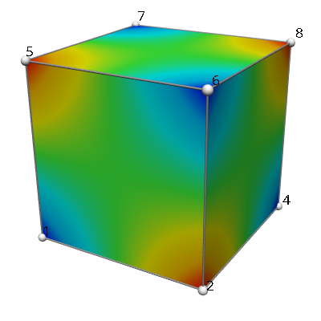

Cube with pressure field
========================

This FieldML 0.5 document defines a single element cube model which linearly interpolates a 3-D "coordinates" field and a scalar "pressure" field. A visualisation of the result is shown in the folling figure:
 
.. _fig_fieldml_cube_pressure:

   Visualisation of pressure field over cube, with node numbers.

One thing you will notice about FieldML is that small models such as this cube are quite a bit larger than other formats. However as models get larger the difference is typically only in the size of bulk data, and they may become smaller than competing formats.

All FieldML 0.5 documents begin with a header defining the encoding, with the ``FieldML`` tag specifying the version of FieldML including a web link to its schema file and other XML information. This is followed by the single ``Region`` element in which all other definitions are made:

.. literalinclude:: cube_pressure.fieldml
  :language: xml
  :lines: 1-3

Next comes an ``Import`` block which imports the shapes, basis functions and associated definitions used in this model from the FieldML 0.5 Standard Library:

.. literalinclude:: cube_pressure.fieldml
  :language: xml
  :lines: 4-16

Note that local names may be different if desired.

OpenCMISS FieldML documents then define the nodes, node derivatives, versions, some predefined constant evaluators for derivatives and versions, and arguments for each Type:

.. literalinclude:: cube_pressure.fieldml
  :language: xml
  :lines: 17-43

Next is the argument representing the unknown node parameters, a real value as a function of nodes, node_derivatives and node_versions:

.. literalinclude:: cube_pressure.fieldml
  :language: xml
  :lines: 44-50

The mesh "mesh3d" is defined, including a constant mapping from the single element label to a cube shape bounds evaluator. Also defined is a mesh argument:

.. literalinclude:: cube_pressure.fieldml
  :language: xml
  :lines: 51-62

To allow future support for switching element field template by element, an ``EnsembleType`` is created to identify each one. It isn't used in this model:

.. literalinclude:: cube_pressure.fieldml
  :language: xml
  :lines: 63-67

Newer OpenCMISS FieldML 0.5 documents use the following definition of a generic element field template ("eft") that describes interpolation and parameter mapping from parameters at local nodes, which in more complicated examples may also be scaled by local scale factors. This is fairly verbose, but the final two evaluators should be somewhat self-explanatory; the parameters clearly specifying which node derivative and version is obtained from which local node to become each element parameter:

.. literalinclude:: cube_pressure.fieldml
  :language: xml
  :lines: 68-165

The local-to-global node map is serialised here in an inline string ``DataResource`` from a ``ParameterEvaluator``: 

.. literalinclude:: cube_pressure.fieldml
  :language: xml
  :lines: 166-183

Next the final element field template is made by applying the generic element field template, using bindings to make it in terms of the actual mesh chart, the global node parameters argument and using the known local-to-global node map:

.. literalinclude:: cube_pressure.fieldml
  :language: xml
  :lines: 184-190

The field template is now defined. It doesn't vary with elements, but by convention we still make it a ``PiecewiseEvaluator`` over mesh elements:

.. literalinclude:: cube_pressure.fieldml
  :language: xml
  :lines: 191-196

Next we define the "coordinates" field, including its node parameters. The "coordinates" produces a value of Standard Library Type "coordinates.rc.3d.component.argument" meaning it produces 3-D rectangular Cartesian coordinates:

.. literalinclude:: cube_pressure.fieldml
  :language: xml
  :lines: 197-221

Next is the scalar "pressure" field. In this case a new scalar ``ContinuousType`` "pressure.domain" defines the codomain of the field:

.. literalinclude:: cube_pressure.fieldml
  :language: xml
  :lines: 222-244

Finally the document finishes with ``Region`` and ``FieldML`` end tags:

.. literalinclude:: cube_pressure.fieldml
  :language: xml
  :lines: 245-246
