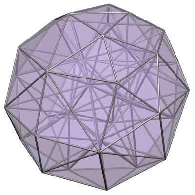

FieldML Example: Tetrahedral Mesh
=================================

This FieldML 0.5 model is of a trilinear tetrahedral mesh in a coarse sphere shape. Meshes consisting of just tetrahedral elements are commonly produced by automatic mesh generators, and are typically homogeneous in basis functions as well. The FieldML document in the example can be readily adapted by changing the number of tetrahedral elements, and linking to other connectivity and node field parameters to import a different model, and this example lists the places where such changes must be *carefully* made to do this.
 
.. _fig_fieldml_tetmesh:

   Tetrahedral mesh of a coarse sphere, read from FieldML.

A feature of this example is that it uses external text data resources for node connectivity (local-to-global node map) and node coordinates. Links to these files are given in ``DataResourceHref`` elements in the FieldML document, and the files themselves are listed below the FieldML file.

Following is the tetrahedral mesh model serialised in FieldML. It is similar to the cube example except it has 38 elements (all tetrahedral shape), 102 nodes, and the single element field template uses a trilinear simplex basis with 4 local nodes. To adapt this model to a different linear tetrahedral mesh with different numbers of nodes and elements requires content of the highlighted lines to be modified with the new filenames containing the bulk data, changing the ``EnsembleType`` nodes and mesh elements to have the new numbers of nodes and elements, and also changing the ``ArrayDataSource`` sizes to match the numbers of nodes or elements as appropriate. That multiple parts need changing to modify the model is one of the main differences compared to a 'serial' data format such as the EX format: in the EX format it is simple to add another node or element with the same template as a prior one, however such convenience comes with a loss of random accessibility of data.

.. literalinclude:: tetmesh.fieldml
  :language: xml
  :lines: 1-185
  :emphasize-lines: 18-20,53-55,130-138,160-168
  :linenos:

The file ``tetmesh.mesh3d.eft1.localtoglobalnodes.data.txt`` contains the raw local-to-global node map for 4 local nodes of each element, in order of declaration. Note that the ``location`` option in the ``ArrayDataSource`` specifies the line number to start reading data from, and the ``RawArraySize`` and ``ArrayDataSize`` in the above FieldML describe the total and to-be-read array sizes, permitting a range of columns to be parsed out of a larger set. This often allows blocks of data from existing data files to be imported via FieldML. The file contents are:

.. literalinclude:: tetmesh.mesh3d.eft1.localtoglobalnodes.data.txt
  :linenos:

The file ``tetmesh.nodes.coordinates.data.txt`` lists the x, y, z coordinates of all nodes, in order of declaration:

.. literalinclude:: tetmesh.nodes.coordinates.data.txt
  :linenos:
