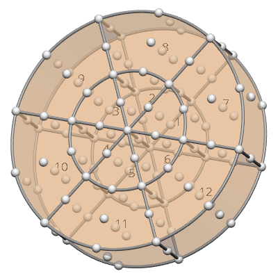

FieldML Example: Wheel With Varying Element Shapes And Functions
================================================================

This FieldML 0.5 example defines a 12 element model of a wheel. The first 6 elements near the axis are *wedge* shaped (triangle extruded along a line) and their coordinates are interpolated using a triquadratic wedge basis with 18 nodes. An outer row of 6 *cube* shaped elements use 27-node triquadratic Lagrange interpolation for the coordinates field. Note that these shape names describe the bounds of the *element chart coordinates*, however their spatial coordinates (field) may be considerably distorted.

The wheel model is illustrated in the following figure:

.. _fig_fieldml_tetmesh:

   FieldML wheel model with varying element shapes and functions. Nodes are drawn as spheres, and element numbers are shown at their centres.

The following sections discuss key parts of the FieldML document, and the full listing is given below.

Varying Element Shapes
----------------------

Switching between wedge and cube shapes is achieved by lines 67 and 70-103 in the FieldML listing. In simpler examples all elements had the same shape, which was specified via a reference in the ``MeshType`` to a single shape bounds evaluator from the FieldML Standard Library. This example switches shape by element in a form that is efficient for large meshes, by:

1. Defining an ``EnsembleType`` "mesh3d.shapeids" whose values will be mapped to the shapes in use;

2. Defining a ``ParameterEvaluator`` "mesh3d.shapemap" and related ``DataSource`` mapping all elements to shapeids, which efficiently separates the bulk data;

3. Marking in the ``MeshType`` that shapes are mapped by the ``PiecewiseEvaluator`` "mesh3d.shape" which switches shape evaluator by element indirectly via the element to shapeids map.

The definitions making up the varying shape map are extracted here:

.. literalinclude:: wheel.fieldml
  :language: xml
  :lines: 70-103
  :linenos:
  :lineno-start: 70

Sparse Element Local-To-Global Node Maps
----------------------------------------

Because half the elements use 18-node triquadratic wedge interpolation and the other half use 27-node triquadratic Lagrange interpolation, there are 2 separate element field templates ("mesh3d.eft1" and "mesh3d.eft2", respectively), and each requires a sparse element local-to-global node map defined over half of the elements.

Here is the local-to-global node map for 18-node triquadratic wedge interpolation:

.. literalinclude:: wheel.fieldml
  :language: xml
  :lines: 298-328
  :linenos:
  :lineno-start: 298

The first column of lines 301-306 is the element number, and the numbers beside them are the identifiers of the global nodes corresponding to the 18 local nodes for each element. The two ``ArrayDataSource`` definitions extract these into 6x1 'key' and 6x18 'data' arrays, used by the sparse *Dictionary of Keys* representation of the ``ParameterEvaluator`` "mesh3d.eft1.localtoglobalnodes". The ``SparseIndexes`` for the ``ParameterEvaluator`` indicate which indexes are in each *record* of the key array, and in what order. The corresponding dense array record contains a complete set of values for all permutations of listed ``DenseIndexes``. In this case the map is sparse over elements, but for those elements it has a global node for every local node.

Mesh Field Template with Varying Element Functions
--------------------------------------------------

Lines 105-109 define an index corresponding to each element field template, useful for mapping to them.

.. literalinclude:: wheel.fieldml
  :language: xml
  :lines: 105-109
  :linenos:
  :lineno-start: 105

Lines 642-670 define a map from elements to the above element field template indexes, and the final ``PiecewiseEvaluator`` "mesh3d.fieldtemplate1" defines the mesh field template via this indirect map, delegating to the appropriate element field template based on which index is returned.

.. literalinclude:: wheel.fieldml
  :language: xml
  :lines: 642-670
  :linenos:
  :lineno-start: 642

The data ensures "eft1" is delegated to in elements 1-6, and "eft2" is delegated to in elements 7-12. This representation achieves the desired separation of bulk data. Note that direct delegation to element field templates from the element would make the XML serialisation impractically large for large models.

Complete FieldML Wheel Model
----------------------------

Following is the full FieldML 0.5 wheel model document:

.. literalinclude:: wheel.fieldml
  :language: xml
  :linenos:
.. :emphasize-lines: 67,70-103,105-109,298-328,604-634,642-670
