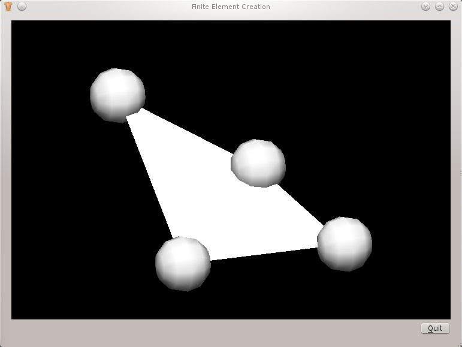

#################################
Tutorial: Finite Element Creation
#################################

The Finite Element Creator application is designed to illustrate how to create a 2D finite element
and visualise it.

This tutorial shows how to

* create a 2D finite element using a template
* visualise the element using a surface graphic and node points

The souce code used in this tutorial is available from the `physiome project svn server <https://svn.physiomeproject.org/svn/cmiss/zinc/bindings/examples/trunk/python/finite_element_creation/>`_.

Overview
========

Finite elements are the building blocks of any model.  To create a model from finite elements the 
Zinc library uses templates.  Using templates enables a modeller to create very large model with ease.

This tutorial uses the same technique for creating an application as the simple axis viewer tutorial, see
this tutorial for more information.

Initialise
==========

The initialisation is done in two parts one for the PyZinc context  and one for the OpenGL Context.
Creating the PyZinc context is straightforward, we need only create a Context object and give it 
a unique name::

 self._context = Context("finiteelementcreation")

We keep a handle to the PyZinc context as any handles originating from this context will be invalid 
once the context has been deleted.

The OpenGL Context is created by Qt and we must set any Zinc scene viewers that we create to have the
same properties.

.. literalinclude:: zinc_widget.py
   :linenos:
   :start-after: # initializeGL start
   :end-before: # initializeGL end

**Line 10** we get the scene viewer package from the graphics module, from the scene viewer package we can create
scene viewers.

**Line 18** here we create a scene viewer we also keep the handle that is returned in the class because 
we will use it a lot.

**Line 25** function call to create a basic linear 2D finite element

**Line 26** function call to create a surface graphic so that we may visualise the 2D finite element 
created on line 25.

**Line 29** using the viewAll() API function from the scene viewer we can set the viewport to contain
all the visible elements of the scene viewer's scene.

Create
======

To create a finite element we must use templates, this is a bit cumbersome for creating basic meshes 
but it is much more useful when we create very big meshes.  Here is the code:

.. literalinclude:: zinc_widget.py
   :linenos:
   :start-after: # create2DFiniteElement start
   :end-before: # create2DFiniteElement end

We will cover some of the more pertinent parts of this code rather taking it line by line.

**Line 12** from the field module we create a finite element field with the desired number of components.
For us the number of components will be used to give us values for a two-dimensional coordinate system.

**Line 14** set the name of the finite element field to 'coordinates'.  We can then search the field module
for this name later on when we require it.

**Line 16** by setting the **is managed** flag we are telling the field module to keep this field around for us
and not delete it when it holds the only reference.

**Lines 19, 20** there exists a special nodeset named 'cmiss_nodes' where we can create nodes that can used
for constructing finite elements.  From the nodeset we create a node template for creating the nodes required
for our finite element.

**Line 23** we set the finite element field as the field for the nodes to use.  We can add any number of fields
to the node template at this point.

**Line 25** create a field cache for storing or retrieving known field values at a location.

**Line 31** define the coordinates of the nodes for our finite element.  Because we are goint to define a 
square two-dimensional finite element with linear basis functions we will use four distinct nodes.  We have 
a range of options open to us here repeated nodes, quadratic basis functions etc. but in this situation we
will use four distinct nodes to describe our finite element.

**Lines 33 - 39** we create our nodes from the nodeset by giving them a unique identifier in the set and the
template to create them from.  We also set the value of the field at the node location by first setting the 
node into the field cache and then assigning the value of the node coordinate to all items in the field cache.
In this case this is the current node we have just created. 

**Lines 44 - 48** we want to create a top-level 2D element so we get the two-dimensional mesh.  We could create
a top-level 3D or 1D element similarly.  From the mesh we create an element template and set the element shape to 
square.  We also tell the template how many nodes we are going to use for defining elements created from the template.

**Line 50** create the element basis function which we are going to use for elements created from this template.

**Line 52** define the indexes of the nodes in the element template in, the node index order is important to create 
an element.  The nodes must be given so that the lowest xi coordinate varies fastest.  For the square with linear
basis functions we have bottom-left, bottom-right, top-left, top-right ordering.

**Line 58** define a simple nodal field on the element template over the finite element field for all components
using a linear basis with node indexes [1, 2, 3, 4].

**Lines 60 - 63** we set the nodes from the nodeset into the element template at the given **node index**.

**Line 64** define the element automatically generating the integer identifier from the element template.  If we required
a handle to the element we could use the createElement() function from the mesh object.

Visualise
=========

Once we have created a finite element we would like to visualise it.  Because we have made a 2D finite
element we can view it using a surface graphic.  Much of this code is the same as we have seen in the 
simple axis viewer tutorial so we will only look at the bits that have changed. 

.. literalinclude:: zinc_widget.py
   :linenos:
   :start-after: # createSurfaceGraphic graphic start
   :end-before: # createSurfaceGraphic graphic end

**Line 1** get the field module for the region.

**Line 2** we get the finite element field created in this field module by name.  Alternatively we could
have kept a handle to the field created in create2DFiniteElement().

**Line 6** from the scene for the region create a surface graphic.

**Line 7** set the coordinate field for the graphic.  The finite element field is defined over the domain of the 
finite element, the domain is specified by the nodes we created.

**Line 11** from the scene create a graphic points visualisation.

**Line 13** set the domain type for the graphic points to be DOMAIN_NODES.

**Line 15** set the glyph type to GLYPH_TYPE_SPHERE, note: if we don't call defineStandardGlyphs() then we won't see the node points.

**Line 16** set the base size of the graphic, again note: if we don't set the base size we won't see the node points
 
